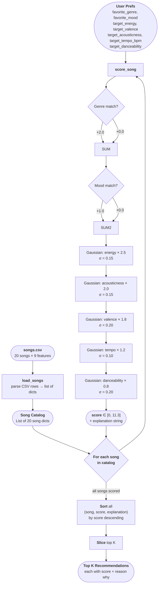

# 🎵 Music Recommender Simulation

## Project Summary

In this project you will build and explain a small music recommender system.

Your goal is to:

- Represent songs and a user "taste profile" as data
- Design a scoring rule that turns that data into recommendations
- Evaluate what your system gets right and wrong
- Reflect on how this mirrors real world AI recommenders

This simulation builds a content-based music recommender that matches songs to a user's taste profile using numeric audio features and categorical preferences. Given a `UserProfile` with preferred energy level, valence, acousticness, danceability, tempo, genre, and mood, the system scores every song in the catalog by measuring how close each feature is to the user's preference, then returns the top-ranked matches. The goal is to prioritize overall "vibe fit" — a combination of emotional tone and listening context — over any single attribute like genre alone.

---

## How The System Works

Real-world recommenders like Spotify and YouTube learn from two sources at once: what millions of other users with similar taste have listened to (collaborative filtering), and the actual properties of the content itself — tempo, energy, acousticness, and so on (content-based filtering). At scale, these signals are combined inside deep neural networks that re-rank hundreds of candidates in milliseconds. This simulation focuses exclusively on the content-based half of that pipeline. Rather than learning from other users, it compares a song's audio features directly against a single user's stated preferences and scores the closeness of that match. The priority here is **vibe alignment**: getting the emotional tone (valence), physical intensity (energy), and acoustic texture (acousticness) right before worrying about genre labels, because those three features together predict listening context more reliably than any single categorical tag.

### `Song` Features

Each `Song` object stores the following:

| Feature | Type | What it captures |
|---|---|---|
| `id` | int | Unique catalog identifier |
| `title` | str | Song name |
| `artist` | str | Artist name |
| `genre` | str | Broad style category (pop, lofi, rock, ambient, jazz, synthwave, indie pop) |
| `mood` | str | Contextual label (happy, chill, intense, relaxed, moody, focused) |
| `energy` | float [0–1] | Physical intensity — loudness, drive, activity level |
| `tempo_bpm` | float | Speed in beats per minute |
| `valence` | float [0–1] | Emotional brightness — high = happy/uplifting, low = dark/melancholic |
| `danceability` | float [0–1] | How well the rhythm suits movement |
| `acousticness` | float [0–1] | Degree of acoustic vs. electronic production |

### `UserProfile` Fields

Each `UserProfile` object stores the user's preferred value for every numeric feature, plus categorical preferences for genre and mood:

| Field | Type | Purpose |
|---|---|---|
| `preferred_energy` | float [0–1] | Target energy level for the listening session |
| `preferred_valence` | float [0–1] | Target emotional tone |
| `preferred_acousticness` | float [0–1] | Preference for acoustic vs. electronic texture |
| `preferred_danceability` | float [0–1] | Preference for rhythmic movement |
| `preferred_tempo_bpm` | float | Target tempo (normalized to [0–1] internally) |
| `preferred_genre` | str | Favorite genre — matched as a binary bonus |
| `preferred_mood` | str | Preferred contextual mood — matched as a binary bonus |

### Algorithm Recipe

Each song is scored by summing points across seven rules. The maximum possible score is **11.3**.

**Step 1 — Categorical bonuses (binary)**

| Rule | Points | Reasoning |
|---|---|---|
| Genre matches `favorite_genre` | +2.0 | Genre is the most stable user preference — a lo-fi listener almost never accepts metal regardless of other features |
| Mood matches `favorite_mood` | +1.0 | Mood is session-dependent and softer, so it earns half the genre bonus |

**Step 2 — Gaussian proximity scores (continuous)**

For each numeric feature, the formula is:

```
feature_score = exp( -(song_value - user_target)² / (2 × σ²) ) × weight
```

A perfect match returns the full weight. The score decays toward 0 the further the song drifts from the target. Sigma (σ) controls how forgiving the tolerance is.

| Feature | Max Points | σ | Reasoning |
|---|---|---|---|
| Energy | +2.5 | 0.15 | Strongest predictor of listening context (workout vs. study vs. sleep) |
| Acousticness | +2.0 | 0.15 | Sharp axis between electronic and organic texture — tight tolerance |
| Valence | +1.8 | 0.20 | Emotional brightness is real but fuzzier — wider tolerance |
| Tempo | +1.2 | 0.10 | Pace is physically felt; tightest tolerance of any feature |
| Danceability | +0.8 | 0.20 | Correlated with energy, so given the lowest weight to reduce redundancy |

**Step 3 — Explanation filter**

A feature only appears in the output explanation when it scores ≥ 80% of its maximum. This keeps the "Because:" line honest — it only reports features that genuinely drove the result.

**Step 4 — Ranking**

All (song, score, explanation) tuples are sorted descending by score. The top K are returned (default K = 5).

### Potential Biases

- **Genre lock-in.** Genre is the single highest-weighted signal (+2.0 flat bonus). A song that matches on all five numeric features but has the wrong genre label will lose to a same-genre song that only partially matches on energy. This means excellent cross-genre suggestions — a jazz song with perfect energy and valence for a lo-fi user — get buried.

- **The catalog is too small and too culturally narrow.** 20 songs written by one person encodes one person's idea of what "chill" or "intense" means. A user from a different musical background will find the mood and genre labels don't map to their experience, and the scoring will feel arbitrary.

- **Mood is treated as a permanent preference, not a context.** The profile stores one `favorite_mood` and awards it a fixed bonus every session. Real listeners want different things at 8am versus midnight. A system that can't model time-of-day or activity context will keep recommending the same mood regardless of what the user actually needs right now.

- **The Gaussian assumption punishes "acceptable range" preferences.** The formula assumes users want exactly one target value, with a smooth decay in both directions. But some users have a threshold preference — "anything above energy 0.7 is fine" — not a peak preference. A song at 0.95 energy would score lower than a song at 0.75 even if both are genuinely acceptable to the user.

- **No diversity enforcement.** The ranking rule is a pure sort. If the top 5 songs are nearly identical lo-fi tracks, the user gets a homogeneous list with no discovery. Real systems (Spotify, YouTube) apply a diversity penalty to prevent this.

### Data Flow Diagram



---

## Getting Started

### Setup

1. Create a virtual environment (optional but recommended):

   ```bash
   python -m venv .venv
   source .venv/bin/activate      # Mac or Linux
   .venv\Scripts\activate         # Windows

2. Install dependencies

```bash
pip install -r requirements.txt
```

3. Run the app:

```bash
python -m src.main
```

### Running Tests

Run the starter tests with:

```bash
pytest
```

You can add more tests in `tests/test_recommender.py`.

---

## Experiments You Tried

Use this section to document the experiments you ran. For example:

- What happened when you changed the weight on genre from 2.0 to 0.5
- What happened when you added tempo or valence to the score
- How did your system behave for different types of users

---

## Limitations and Risks

Summarize some limitations of your recommender.

Examples:

- It only works on a tiny catalog
- It does not understand lyrics or language
- It might over favor one genre or mood

You will go deeper on this in your model card.

---

## Reflection

Read and complete `model_card.md`:

[**Model Card**](model_card.md)

Write 1 to 2 paragraphs here about what you learned:

- about how recommenders turn data into predictions
- about where bias or unfairness could show up in systems like this


---

## 7. `model_card_template.md`

Combines reflection and model card framing from the Module 3 guidance. :contentReference[oaicite:2]{index=2}  

```markdown
# 🎧 Model Card - Music Recommender Simulation

## 1. Model Name

Give your recommender a name, for example:

> VibeFinder 1.0

---

## 2. Intended Use

- What is this system trying to do
- Who is it for

Example:

> This model suggests 3 to 5 songs from a small catalog based on a user's preferred genre, mood, and energy level. It is for classroom exploration only, not for real users.

---

## 3. How It Works (Short Explanation)

Describe your scoring logic in plain language.

- What features of each song does it consider
- What information about the user does it use
- How does it turn those into a number

Try to avoid code in this section, treat it like an explanation to a non programmer.

---

## 4. Data

Describe your dataset.

- How many songs are in `data/songs.csv`
- Did you add or remove any songs
- What kinds of genres or moods are represented
- Whose taste does this data mostly reflect

---

## 5. Strengths

Where does your recommender work well

You can think about:
- Situations where the top results "felt right"
- Particular user profiles it served well
- Simplicity or transparency benefits

---

## 6. Limitations and Bias

Where does your recommender struggle

Some prompts:
- Does it ignore some genres or moods
- Does it treat all users as if they have the same taste shape
- Is it biased toward high energy or one genre by default
- How could this be unfair if used in a real product

---

## 7. Evaluation

How did you check your system

Examples:
- You tried multiple user profiles and wrote down whether the results matched your expectations
- You compared your simulation to what a real app like Spotify or YouTube tends to recommend
- You wrote tests for your scoring logic

You do not need a numeric metric, but if you used one, explain what it measures.

---

## 8. Future Work

If you had more time, how would you improve this recommender

Examples:

- Add support for multiple users and "group vibe" recommendations
- Balance diversity of songs instead of always picking the closest match
- Use more features, like tempo ranges or lyric themes

---

## 9. Personal Reflection

A few sentences about what you learned:

- What surprised you about how your system behaved
- How did building this change how you think about real music recommenders
- Where do you think human judgment still matters, even if the model seems "smart"

